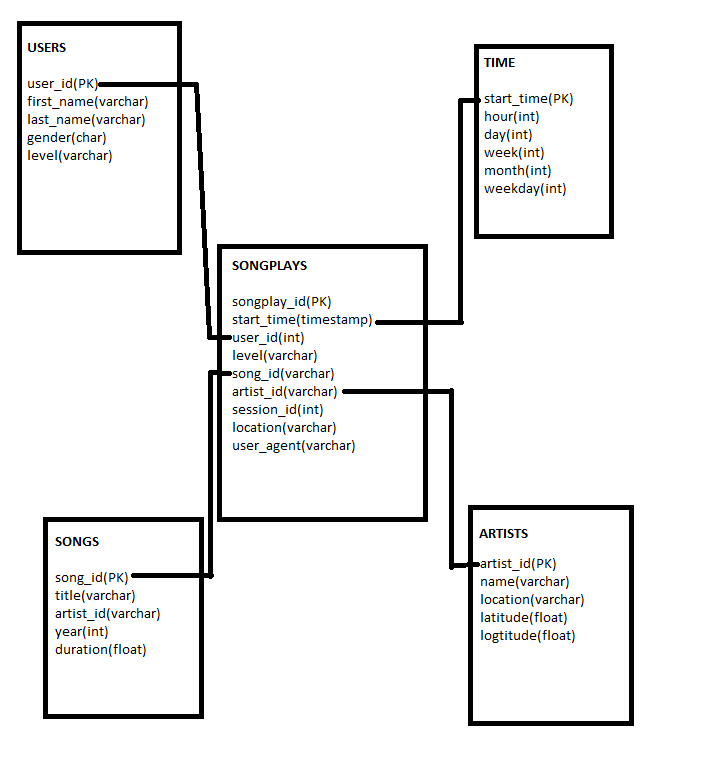

# SBK
Data Engineering NanoDegree Projects
# Project 1 - Data Modeling with Postgres

The Sparkify initiative wants to analyze user activities using songs and user data. 
Existing data is stored in JSON files. This makes it difficult to query and analyze.

## Getting Started

This project creates an ETL pipeline by loading all json format song and user data into a Postgres database, making it easier to query and analyze the data.

### **Song Dataset**
Sample Record :
```
{"num_songs": 1, "artist_id": "ARJIE2Y1187B994AB7", "artist_latitude": null, "artist_longitude": null, "artist_location": "", "artist_name": "Line Renaud", "song_id": "SOUPIRU12A6D4FA1E1", "title": "Der Kleine Dompfaff", "duration": 152.92036, "year": 0}
```

### **Log Dataset**
Sample Record :
```
{"artist": null, "auth": "Logged In", "firstName": "Walter", "gender": "M", "itemInSession": 0, "lastName": "Frye", "length": null, "level": "free", "location": "San Francisco-Oakland-Hayward, CA", "method": "GET","page": "Home", "registration": 1540919166796.0, "sessionId": 38, "song": null, "status": 200, "ts": 1541105830796, "userAgent": "\"Mozilla\/5.0 (Macintosh; Intel Mac OS X 10_9_4) AppleWebKit\/537.36 (KHTML, like Gecko) Chrome\/36.0.1985.143 Safari\/537.36\"", "userId": "39"}
```


## Files:
1.  test.ipynb displays the first few rows of each table to let you check your database.
2.  Create_tables.py drops and creates tables of project. You run this file to reset your tables before each time you run your ETL scripts.
3.  etl.ipynb reads and processes a single file from song_data and log_data and loads the data into project tables. This notebook contains detailed instructions on the ETL process for each of the tables.
4.  etl.py reads and processes files from song_data and log_data and loads them into the tables.
5.  sql_queries.py contains all sql queries, and is imported into the last three files above.

## Prerequisites

*   Python 3.6 (or above https://realpython.com/installing-python/)
*   psycopg2 - PostgreSQL database adapter for Python (https://www.psycopg.org/install/)

## Database Schema

You can see the datamodel of star schema the project, fact table is songplays and four dimension tables are time, users, songs and artists.



## Installing

1) Run python "create_tables.py" if there is a table dropes them and creates tables. 
2) After dropping and creating finished successfully, you can run "python etl.py" to create ETL pipeline.

```commandline
root@0458ce8d4cae:/home/workspace# python create_tables.py
Tables are dropped successfully!
Tables are created successfully!
root@0458ce8d4cae:/home/workspace# python etl.py
80 files found in data/song_data
1/80 files processed.....
.........................
80/80 files processed.
30 files found in data/log_data
1/30 files processed.....
.........................
30/30 files processed.
```

### Examples

After finished you can connect to sparkifydb through the test.ipynb and run queries to test the datas as follows some of the example datas you can get:

#### Songsplays:
| songplay_id | start_time | user_id | level | song_id | artist_id | session_id | location | user_agent 
| :------------- | :----------: | -----------: | -----------: | -----------: | -----------: | -----------: | -----------: | -----------: |
|2018-11-30 00:22:07.796000|91|free|None|None|829|Dallas-Fort Worth-Arlington, TX|Mozilla/5.0 (compatible; MSIE 10.0; Windows NT 6.2; WOW64; Trident/6.0)
|2018-11-30 01:08:41.796000|73|paid|None|None|1049|Tampa-St. Petersburg-Clearwater, FL|"Mozilla/5.0 (Macintosh; Intel Mac OS X 10_9_4) AppleWebKit/537.78.2 (KHTML, like Gecko) Version/7.0.6 Safari/537.78.2"
|2018-11-30 01:12:48.796000|73|paid|None|None|1049|Tampa-St. Petersburg-Clearwater, FL|"Mozilla/5.0 (Macintosh; Intel Mac OS X 10_9_4) AppleWebKit/537.78.2 (KHTML, like Gecko) Version/7.0.6 Safari/537.78.2"


#### Songs:
| song_id | title | artist_id | year | duration 
| :------------- | :----------: | -----------: | -----------: | -----------: |
|SOMZWCG12A8C13C480	|I Didn't Mean To	|ARD7TVE1187B99BFB1	|0	|218.93179
|SOUDSGM12AC9618304	|Insatiable (Instrumental Version)	|ARNTLGG11E2835DDB9	|0	|266.39628
|SOIAZJW12AB01853F1	|Pink World	|AR8ZCNI1187B9A069B	|1984	|269.81832
|SOHKNRJ12A6701D1F8	|Drop of Rain	|AR10USD1187B99F3F1	|0	|189.57016
|SOCIWDW12A8C13D406	|Soul Deep	|ARMJAGH1187FB546F3	|1969	|148.03546


#### Users:
|user_id|first_name|last_name|gender|level
| :------------- | :----------: | -----------: | -----------: | -----------: |
|91|Jayden|Bell|M|free
|73|Jacob|Klein|M|paid
|86|Aiden|Hess|M|free
|24|Layla|Griffin|F|paid
|26|Ryan|Smith|M|free


## Tests
With Jupyter you can test every step seperately as follows:

*   You can test every step of getting data from tables into test.ipynb
*   You can test ETL process with etl.ipynb

## Authors

* **Secil Bilge** - *Data Engineering NanoDegree First Project* - (https://github.com/SecilBilge)


